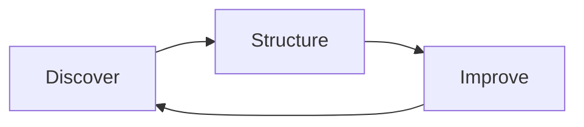

Klarity runs the **Discover → Structure → Improve** loop continuously, replacing one-time "transformation projects" that take months and have a low success rate. When your agent uses the MCP, it's plugging into that loop.

## Discover

The Companion (ambient capture from sessions) and the Interviewer (AI-guided structured capture) generate raw process knowledge from how work actually happens. Agents read this layer through process, observation, and artifact tools.

What lives here:

- Observations from real sessions (deviations, exceptions, manual workarounds)
- Source artifacts (BRDs, SOPs, video recordings, screenshots, logs)
- Activity timelines that show the exact sequence of user actions

## Structure

The [Process Index](/concepts/process-index) and the [Context Graph](/concepts/context-graph) are the living, queryable map of your organization. Agents navigate this layer through `search`, `fetch`, hierarchy, and graph tools.

What lives here:

- A versioned hierarchy of every process the organization runs
- An entity graph linking processes, systems, teams, controls, and the relationships between them
- Communities that cluster related work

## Improve

Use Klarity Advisor or this MCP in your AI tools to analyze thousands of processes at once — surface improvement opportunities, drive transformation, and build skills and agents grounded in how your business actually runs.

## What this means for your assistant

Any question your assistant asks usually maps to one stage of the loop:

| Question shape | Loop stage | Where to look |
|---|---|---|
| "What's our evidence for X?" | Discover | Observations, activity timelines, artifacts |
| "How does X work today?" | Structure | Process Index, Context Graph |
| "Where should we focus next?" | Improve | Observations, dependency graph, recent changes |

The [Tool reference](/tools/overview) is organized along the same axis.
